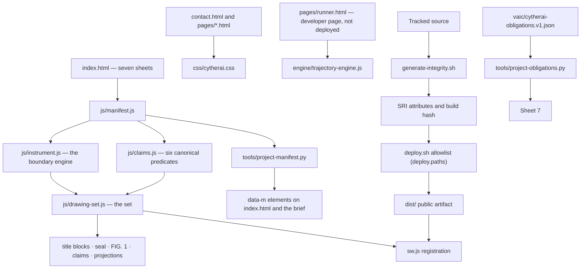

# Repository architecture

This guide describes the current tree, the runtime data flow, and the files that
must move together when the site changes. The repository is a zero-dependency
static site: source HTML, CSS, and JavaScript are served directly. There is no
framework, package graph, bundle, or server application.

The homepage is **the drawing set** (since 2026-09-16). Its predecessor, the substrate /
disclosure-engine homepage **instrument-v1**, is retired whole to `backup/instrument-v1/`
— a verbatim snapshot of commit `bf82377` with every verifier that established its laws;
its README indexes it and `backup/instrument-v1/verify.sh` runs them. This guide as it
stood for that world is `git show bf82377:docs/architecture.md`.

## System map



The homepage modules are classic deferred scripts and communicate through four
explicit `window` APIs. Load order is a contract, not an incidental HTML detail: the
claims module reads `CytherSubstrate`'s absence at load and registers the canonical
register only; the set pushes its own predicates before the first render. The public
surface is an inventory (`tools/test-api.py`): every symbol is declared as production
(called by another served module) or verifier (used by a tool), and a symbol with no
caller fails verification.

| Order | Module | Public API | Responsibility |
|---:|---|---|---|
| 1 | `js/manifest.js` | `CytherManifest` | Public disclosure tuple, deterministic parameters (`dsin`, `dsinOrbit`), admission, checksum, epoch history, `project` |
| 2 | `js/instrument.js` | `CytherInstrument` | The boundary engine: `biEngine` (seeded hostile proposer, incremental admission, independent kernel; every event names the position it was judged from), `judge` (a proposed program against the same boundary and kernel), `audit`, `lastAudit`. Pure, DOM-free; `tools/test-boundary.js` pins the seed-02 stream |
| 3 | `js/claims.js` | `CytherClaims` | The six canonical predicates (CL-01 zero external requests · CL-02 render ≡ manifest over every `[data-checksum]` site and every `data-m` fact · CL-03 published admission ≡ derivation · CL-05 the boundary emits no invalid program · CL-06b the mark does not flood the reading lane · CL-07 deterministic admission core), the stored-state registry, per-claim and all-claim recomputation, the renderer (`#claimRows`, `#claimsFooter`, `[data-claims-count]`) |
| 4 | `js/drawing-set.js` | `CytherDrawingSet` | The set: the frame on every sheet (zone strips, title block, notes, seal), projections of the manifest (revisions, not claimed, chain of record), FIG. 1 and the adjustable edge, the admitted object carried through sheets 2–6, DS-01..05, CL-03/CL-05 setting, `sw.js` registration. Pure geometry exported for `tools/test-drawing-set.js` |

## Directory and ownership map

| Path | Role | Public artifact? | Change rule |
|---|---|---|---|
| `index.html` | The seven sheets and their inline visual system | Yes | Every HTML byte moves the build identity: re-stamp after any edit; SCHEDULE 1, the sheet-1 figures and the sealed-records count are projector-owned (`data-m`); Sheet 7's obligations block is projector-owned |
| `js/` | The four homepage modules | All four | A module change requires `./generate-integrity.sh` (SRI) and re-stamping |
| `css/cytherai.css` | Shared subpage style system | Yes | Hashed; its ink law is `tools/test-site.py` |
| `contact.html` | Contact surface with the repository's one inline form script | Yes | Preserve the explicit `mailto:`/no-backend semantics unless hosting changes |
| `pages/` | Brief and legal pages; `runner.html` is a developer page | Content pages only | Content pages share navigation and CSS; `runner.html` is linked from no page, not in `deploy.paths`, not precached, unstamped |
| `engine/` | Trajectory engine and its browser suite | No | Run locally through `pages/runner.html`; not part of the homepage dependency graph or the artifact |
| `assets/` | Promoted deterministic images and icons | Selected files | Record provenance in `docs/asset-promotion-log.md`; add to `deploy.paths`; precache only if offline-critical |
| `tools/` | Generators and zero-dependency test programs | No | Generators must reproduce committed bytes; tests must fail nonzero; a new harness file is added to `IDENTITY_COVERAGE` |
| `vaic/` | The VAIC-0 obligation corpus (`v1`, superseding `v0`, which stays as history), evaluator matrix, evidence ledger, release dispositions | No | Receipts append; admitted receipts are immutable across both lineages (`tools/test-vaic.py`) |
| `docs/` | Deployment contract, audit record (00–08, all instrument-v1), asset provenance, architecture | No | Evidence and operational instructions, never origin content |
| `newC3/` | Frozen design/prototype record and public demo preimage | No | Supersede; do not rewrite or deploy |
| `backup/` | Retired surfaces: `instrument-v1/` (whole, with verifiers), `graphite-v2/`, `dossier-v3/`, `trajectory-engine/`, `drawing-set-demo.html` | No | Historical record only; retire here, never delete, never deploy |
| `awc-os/` | Gitignored AWC-OS evaluation microsite and media | No | Separate artifact with separate network/product assumptions |
| `dist/` | Generated allowlisted release artifact | Generated | Rebuilt destructively by `deploy.sh`; never hand-edit |

## Homepage boot and steady state

`js/drawing-set.js` runs after the three APIs exist.

1. The seal is drawn once from `CytherManifest.CANON` (`dsinOrbit`, 16,000 points) and
   stamped onto every title block; each sheet receives zone strips, its title block
   (title, DRAWN FROM + checksum, CHECKED BY + count, REV · EPOCH · DATE, SHEET n / 7,
   APPROVED seal) and its notes block from `data-title` / `data-notes`.
2. Revisions (epochs and commitments — the commitment status printed verbatim), not
   claimed, the chain of record and the obligations count are rendered from the manifest.
   SCHEDULE 1 and the sheet-1 figures are already bytes: `tools/project-manifest.py` wrote
   them, so a reader without scripts has them.
3. FIG. 1 runs `biEngine(2)` for 1,500 proposals at 5 per frame. Refusals appear in the
   construction field where they were judged, with a witness at the offending relation,
   and age out; the live program is drawn as it grows; on admission the LARGEST program
   so far is stated by identity and inked over a ~500 ms resolution (smaller admissions
   flash once). With reduced motion the run completes synchronously.
4. On settle: counters, refusals by class (FIG. 2b), the REFUSED box, CL-05 and DS-05 are
   set; the adjustable edge appears (pointer along its normal, or arrow keys; Enter
   accepts an admitted candidate; Escape resets); the admitted object is rendered into
   the five `.obj` boxes on sheets 2–6.
5. The claims render pending, then executable predicates recompute 150 ms after load; the
   three published admissions are re-derived in yielded steps for CL-03. RECOMPUTE ALL
   re-runs every predicate that has a `run`.
6. The service worker registers from the root; its cache name carries the build hash.

At steady state nothing runs: the field ages out, the settle loop stops, and the page is
static until RUN AGAIN, AUDIT 10,000, the handle, or RECOMPUTE ALL.

## State and evidence boundaries

- Canonical state comes from `CytherManifest.MANIFEST` and deterministic derivation. Its
  checksum, seal and admissions can be recomputed; the page prints the checksum at every
  title block and CL-02 reads each site back.
- The admitted object in FIG. 1 is this browser's demonstration: it is judged by the
  production boundary and kernel, carried through the sheets with a local derivation
  receipt, and enters no record. It never mixes with a manifest fact.
- The claims engine stores one result per claim. Recomputing one claim changes only that
  result; a passing re-run cannot erase an unrelated invalid state (`tools/test-claims.js`).
- Sheet 7 discloses what the set owes and who may establish it — never a receipt or a
  verdict, because a receipt for a build cannot be inside that build.

## Routes

| Route | Runtime |
|---|---|
| `/` or `/index.html` | The drawing set, four modules |
| `/contact.html` | Shared CSS plus one inline validation/copy script |
| `/pages/brief.html` | Static capability brief and promoted exhibits |
| `/pages/privacy.html` | Static privacy record |
| `/pages/security.html` | Static disclosure policy |
| `/pages/terms.html` | Static terms |
| `/404.html` | Host-configured styled error body; the host must still return status 404 |

## Integrity, deployment, and offline behavior

The release flow is fail-closed:

1. Edit source. After a manifest edit run `python3 tools/project-manifest.py`; after an
   obligation edit run `python3 tools/project-obligations.py`.
2. For any change to a served file (anything in `deploy.paths`), run
   `./generate-integrity.sh` (SRI over the requested resources; the 16-hex build identity
   over every `deploy.paths` byte, stamped into every HTML file and the worker cache
   name), then `python3 tools/vaic_restamp.py` once per transaction.
3. Run `./verify.sh`.
4. `./deploy.sh` deletes and rebuilds `dist/` from `deploy.paths`; it rejects a precached
   asset missing from the artifact and rejects the historical directories.
5. `./publish.sh` pushes the contents of `dist/` as the single-commit `gh-pages` branch
   GitHub Pages serves at `cytherai.com` (`CNAME`, `.nojekyll` are in the artifact). It
   refuses uncommitted served files, a HEAD not on `master`, and a failing `./verify.sh`.
   The origin contract and Pages' recorded limits are `docs/deploy.md` §1–§4, §7.

The service worker precaches the pages and the four modules, installs one build or
nothing (every fetch past the HTTP cache, the build stamp checked before commit), maps a
navigation to the scope root to cached `index.html`, and removes older caches on activate.

## Verification map

```sh
./verify.sh
```

Module parsing, the public API inventory, the claims-suite law, the boundary stream, the
drawing set's object and edge, the projection laws, page/resource integration, SRI/build/
cache identity, deployment closure, the subpage ink law, the derived-asset receipts, and
the VAIC-0 corpus (structure, retired-evidence resolution, fail-closed controls).

Browser-only validation remains required for: `CLAIMS 11/11 HOLDING` after settle at
desktop and phone widths; the seal and FIG. 1 as rendered; the adjustable edge by pointer
and keyboard; layout at 200% zoom and reduced motion; service-worker install/update/
offline; Safari/WebKit rendering and VoiceOver.

## Change-impact recipes

- Add or remove a homepage module: `index.html`, `generate-integrity.sh` (RESOURCES),
  `deploy.paths`, `sw.js`, `tools/test-api.py` (MODULES, SERVED, INVENTORY),
  `tools/test-site.py` (module order), `IDENTITY_COVERAGE`, and this guide.
- Add a public page: navigation links/current-page state, build-hash meta, CSP, local
  icon/manifest references, `generate-integrity.sh` (HTML_FILES), `deploy.paths`, and
  decide whether it belongs in `sw.js`.
- Add a claim: a canonical `CL` number only where the predicate is the canonical one;
  otherwise a `DS` pushed onto `CytherClaims.CLAIMS` in `js/drawing-set.js` with its
  method sentence; `tools/test-claims.js` holds the canonical six.
- Change manifest facts: review every `PROVISIONAL` marker, run the projector, regenerate
  integrity, and treat a genuine commitment as an owner-custody decision.
- Change an obligation: edit the corpus, run `tools/project-obligations.py` (Sheet 7),
  regenerate integrity, re-stamp; never edit an admitted receipt.
- Retire a served file: move it whole into the declared snapshot, add it to `RETIRED`,
  remove it from `deploy.paths`; the receipts that cite it keep resolving.
