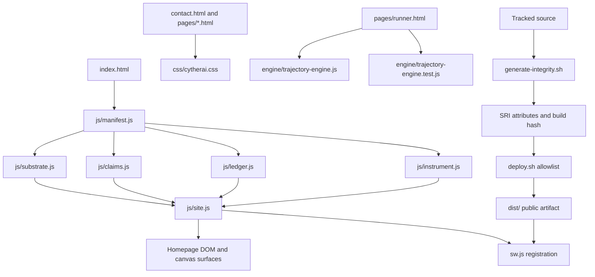

# Repository architecture

This guide describes the current tree, the runtime data flow, and the files that
must move together when the site changes. The repository is a zero-dependency
static site: source HTML, CSS, and JavaScript are served directly. There is no
framework, package graph, bundle, or server application.

## System map



The homepage modules are classic deferred scripts and communicate through five
explicit `globalThis`/`window` APIs. Load order is a contract, not an incidental
HTML detail.

| Order | Module | Public API | Responsibility |
|---:|---|---|---|
| 1 | `js/manifest.js` | `CytherManifest` | Public disclosure tuple, deterministic parameters, admission, checksum, epoch history |
| 2 | `js/substrate.js` | `CytherSubstrate` | Orbit geometry, four exposure plates, camera, ambient/reading model, fork state |
| 3 | `js/claims.js` | `CytherClaims` | Ten standing predicates, stored evidence, per-claim and all-claim recomputation |
| 4 | `js/ledger.js` | `CytherLedger` | Session-local, owner-erasable reading self-report and adaptive CTA state |
| 5 | `js/instrument.js` | `CytherInstrument` | Deterministic hostile proposer and independent boundary-kernel audit |
| 6 | `js/site.js` | none | Boot orchestration, the shared animation loop, scroll observation, controls, floor rendering |

## Directory and ownership map

| Path | Role | Public artifact? | Change rule |
|---|---|---:|---|
| `index.html` | Homepage structure and its inline visual system | Yes | Does not move SRI, but every HTML byte moves the build identity (served-artifact manifest): re-stamp after any edit |
| `js/` | Homepage runtime: six page modules and the development worker | All seven | A hashed module change requires `./generate-integrity.sh`; the worker is in the build identity via `deploy.paths` |
| `css/cytherai.css` | Shared subpage style system | Yes | Hashed; regenerate integrity after edits |
| `contact.html` | Contact surface with the repository's one inline form script | Yes | Preserve the explicit `mailto:`/no-backend semantics unless hosting changes |
| `pages/` | Brief, legal pages, and the isolated engine runner | Yes | Content pages share navigation and CSS; runner has a separate module-test CSP |
| `engine/` | Trajectory engine and 33-test browser suite | Yes, runner only | It is not part of the homepage dependency graph |
| `assets/` | Promoted deterministic images and icons | Selected files | Add each promoted file to `deploy.sh`; precache only if offline-critical |
| `tools/` | Generators and zero-dependency test programs | No | Generators must reproduce committed bytes; tests must fail nonzero |
| `docs/` | Deployment contract, audit record, asset provenance, architecture | No | Evidence and operational instructions, never origin content |
| `newC3/` | Frozen design/prototype record and public demo preimage | No | Supersede; do not rewrite or deploy |
| `backup/` | Retired surfaces and branding: `graphite-v2/` with the three modules only it loaded, `dossier-v3/`, `trajectory-engine/` (v2 engine dev source and prototypes) | No | Historical record only; retire here, never delete, never deploy |
| `awc-os/` | Gitignored AWC-OS evaluation microsite and media | No | Separate artifact with separate network/product assumptions |
| `dist/` | Generated allowlisted release artifact | Generated | Rebuilt destructively by `deploy.sh`; never hand-edit |

## Homepage boot and steady state

`js/site.js` starts after all five APIs exist.

1. It parses optional captured state from the URL hash.
2. `CytherSubstrate.boot()` derives the canonical camera once and queues all four
   exposure plates. Plate development is a deterministic fixed-step sequence (`DEV_BATCH`) streamed through the shared frame loop as genuine prefixes — the loop's cadence chooses which prefix is shown, never what it contains; every recurrence is `dsin`/`dcos`/`datan2`, so the plates are engine-invariant and `assets/plate/surface-terminal.png` is provably plate 0's terminal raster; first load swaps that promoted exposure for the reader's own plate at D_N and `REDEVELOP` replays the sequence. Every terminal reply names its checkpoint (`stateHash`); the floor prints the four names as the development receipt and compares a redevelopment of the same world and frame against the last one (`IDENTICAL` / `MISMATCH`), and a plate that stopped at its iteration ceiling instead of its target is printed as a fuse.
   The kernel runs in a dedicated Worker (`js/develop-worker.js`, transport only,
   around `CytherSubstrate.developServer`); the main thread keeps the presentation
   law — which prefix is asked for and when its raster is shown — and falls back
   to running the same server inline where a Worker cannot be constructed
   (`file://`). `tools/test-develop.js` drives the server against the direct
   kernel: execution location changes, the trajectory does not. Responsive
   DPR/bin policies bound mobile allocation and rasters are cadence limited
   rather than produced after every deposit batch.
3. The instrument and ledger attach their DOM behavior; controls, mobile docking,
   hold-to-cross, optics, title glyphs, and wave interactions are wired.
4. Manifest, provenance, epoch, commitment, and anti-manifest rows are rendered
   from `CytherManifest`. The facts the strata print as bytes (counts, validation
   figures) are projections written by `tools/project-manifest.py` into `data-m`
   elements and read back by CL-02 — a literal that is not a projection is a
   second authority and must not be introduced.
5. Claims render pending, then executable predicates recompute after load.
   Published admission nonces are independently re-derived in yielded steps.
6. The service worker registers from the root. Its cache name carries the same
   build hash stamped into every shipped HTML file.

At steady state, scroll work is deliberately narrow: one requestAnimationFrame
updates only changed plate transforms/opacity, ambient CSS variables, the reading
phase, the minimap reticle, and the gauge. Hidden plates release compositor
`will-change`; envelope blur is disabled while moving. Reading samples bounded
90k-cell stratified summaries rather than full plate density fields. A height-only
viewport resize stretches existing plate coverage without replaying development;
width or effective-DPR changes still regenerate. Pointer-driven title effects,
plate development, and the boundary proposer share one loop that sleeps after 40
idle frames.

## State and evidence boundaries

There are three distinct kinds of state:

- Canonical state comes from `CytherManifest.MANIFEST` and deterministic
  derivation. Its checksum and camera can be recomputed.
- Visitor fork and optics state are local presentation state. Fork state can be
  encoded in a URL fragment; the optics choice alone uses `sessionStorage`.
- The reader ledger is an in-memory self-report. It is not durable, not
  independently verifiable, and is transmitted only when the reader invokes a
  mail link after the diligence threshold.

The claims engine stores one result per claim. Recomputing one claim changes only
that result; a passing re-run cannot erase an unrelated invalid state. CL-03 is
special: the expensive admissions are produced asynchronously by `site.js` and
fed into the claims store when complete.

## Routes

| Route | Runtime |
|---|---|
| `/` or `/index.html` | Six-module disclosure engine |
| `/contact.html` | Shared CSS plus one inline validation/copy script |
| `/pages/brief.html` | Static capability brief and promoted exhibits |
| `/pages/privacy.html` | Static privacy record |
| `/pages/security.html` | Static disclosure policy |
| `/pages/terms.html` | Static terms |
| `/pages/runner.html` | Isolated trajectory-engine browser test runner |
| `/404.html` | Host-configured styled error body; the host must still return status 404 |

The five public content pages carry a complete sibling navigation set and mark
exactly one current page. The homepage intentionally uses its own descent model.

## Integrity, deployment, and offline behavior

The release flow is fail-closed:

1. Edit source.
2. For any change to a served file (anything in `deploy.paths` — HTML, JS/CSS,
   the worker, assets), run `./generate-integrity.sh`. It recomputes each SHA-384
   SRI value, derives the 16-hex build identity from the canonical served-artifact
   manifest (every `deploy.paths` file, the two stamped fields blanked), stamps
   all eight HTML files, and updates the service worker cache name. Then run
   `python3 tools/vaic_restamp.py`: it re-stamps the VAIC candidate and appends
   the automated-set receipts for the new build.
3. Run `./verify.sh`. The integration test independently recomputes the same
   identities and checks local references, navigation, manifest icons, and the
   deploy/service-worker relationship.
4. `./deploy.sh` deletes and rebuilds `dist/` from an explicit 27-file allowlist.
   It rejects a service-worker asset missing from the artifact and rejects the
   historical/ignored directories.
5. Publish the contents of `dist/`, not the working tree. Apply and verify the
   origin headers and MIME behavior in `docs/deploy.md`.

The service worker precaches the core routes and runtime. It maps a navigation to
the worker scope root back to cached `index.html`, caches other same-origin GETs
on demand, and removes older cache generations on activation. Promoted social,
brief, and error images are deliberately not all precached.

## Verification map

Run the non-browser battery:

```sh
./verify.sh
```

It covers module parsing, claims-state isolation, ledger semantics, page/resource
integration, SRI/build/cache identity, deployment closure, motion/plate laws, and
the source contracts for responsive plate policy and mobile footer clearance. It
also validates the VAIC-0 obligation corpus and its fail-closed evaluator/coverage
rules after rebuilding the exact artifact to which its receipts are bound.

Browser-only validation remains required for:

- `pages/runner.html` reporting 33/33 and rejecting a zero-test load;
- homepage `CLAIMS 10/10 HOLDING` after initialization;
- layout and hit targets across breakpoints, reduced motion, and 200% zoom;
- service-worker install/update/offline behavior;
- Safari/WebKit rendering, `mailto:` handoff, and VoiceOver behavior.

## Change-impact recipes

- Add or remove a homepage module: update `index.html`, `generate-integrity.sh`,
  `deploy.sh`, `sw.js`, the module-order integration test, and this guide.
- Add a public page: add navigation links/current-page state, build-hash meta,
  CSP, local icon/manifest references, `generate-integrity.sh`, `deploy.sh`, and
  decide whether it belongs in `sw.js`.
- Promote an asset: record provenance in `docs/asset-promotion-log.md`, add it to
  `deploy.sh`, and add it to `sw.js` only when eager offline cost is justified.
- Change manifest facts: review every `PROVISIONAL` marker, run
  `python3 tools/project-manifest.py` (the strata's counts and validation figures on
  `index.html` and `pages/brief.html` are marked projections of the manifest, and
  `tools/test-projection.py` fails on a stale page), regenerate integrity because
  `js/manifest.js` and the pages are hashed, rerun admissions/claims, and treat a
  genuine commitment as an owner-custody decision rather than a source-code assertion.
- Change plate or reading behavior: update the implementation and extend
  `tools/test-exposure.js` (the executed tone-map and reading laws) or
  `tools/test-motion.py` (the source-form laws); browser-test memory, scroll
  smoothness, contrast, and reduced motion at desktop and mobile widths.
