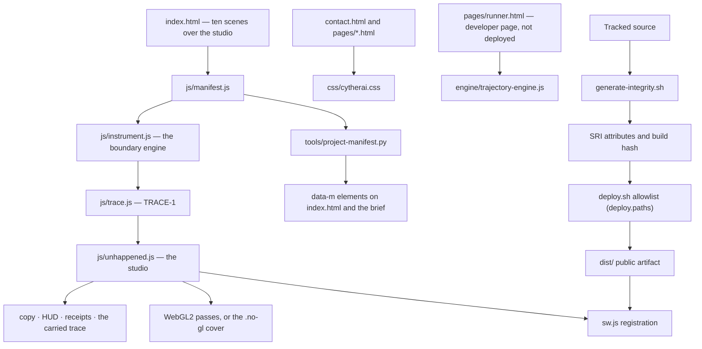

# Repository architecture

This guide describes the current tree, the runtime data flow, and the files that
must move together when the site changes. The repository is a zero-dependency
static site: source HTML, CSS, and JavaScript are served directly. There is no
framework, package graph, bundle, or server application.

The homepage is **THE UNHAPPENED** (since 2026-10-04): a WebGL2 studio in which every
proposal is judged in the browser and only what the kernel admits becomes matter. Its
predecessors are retired whole, each a verbatim snapshot with every verifier that
established its laws and its own `verify.sh`: **the drawing set** to
`backup/drawing-set-v1/` (commit `99b167a`; this guide as it stood for it is
`git show 99b167a:docs/architecture.md`) and **instrument-v1** to `backup/instrument-v1/`
(commit `bf82377`). The drawing set is superseded as presentation and preserved as
historical record; nothing of its design is carried into the front door.

## System map


```mermaid
flowchart TD
  I["index.html — ten scenes over the studio"] --> M["js/manifest.js"]
  M --> B["js/instrument.js — the boundary engine"]
  B --> T["js/trace.js — TRACE-1"]
  T --> U["js/unhappened.js — the studio"]
  U --> DOM["copy · HUD · receipts · the carried trace"]
  U --> GL["WebGL2 passes, or the .no-gl cover"]
  U --> SW["sw.js registration"]

  P["contact.html and pages/*.html"] --> CSS["css/cytherai.css"]
  R["pages/runner.html — developer page, not deployed"] --> E["engine/trajectory-engine.js"]

  SRC["Tracked source"] --> SRI["generate-integrity.sh"]
  SRI --> ID["SRI attributes and build hash"]
  ID --> DEP["deploy.sh allowlist (deploy.paths)"]
  DEP --> DIST["dist/ public artifact"]
  DIST --> SW

  M --> PM["tools/project-manifest.py"] --> DM["data-m elements on index.html and the brief"]
```

The homepage modules are classic deferred scripts and communicate through three
explicit `window` APIs; `js/unhappened.js` exports nothing. Load order is a contract:
each module reads only the APIs loaded before it. The public surface is an inventory
(`tools/test-api.py`): every symbol is declared as production (called by another served
module) or verifier (used by a tool), and a symbol with no caller fails verification.

| Order | Module | Public API | Responsibility |
|---:|---|---|---|
| 1 | `js/manifest.js` | `CytherManifest` | The public manifest: `project` (the `data-m` facts the pages print, read back at runtime) and `fnv`; `MANIFEST`, `VALIDATION`, `CANON`, `ADMISSION_NONCE`, `CHECKSUM` for the verifiers and the derived assets (`tools/canon.py`) |
| 2 | `js/instrument.js` | `CytherInstrument` | The boundary engine: `biEngine` (seeded hostile proposer, incremental admission, independent kernel; every event names the position it was judged from), `judge`, `audit`. Pure, DOM-free; `tools/test-boundary.js` pins the seed-02 stream |
| 3 | `js/trace.js` | `CytherTrace` | TRACE-1, the Cyther Trace: `code` (a receipt → its trace code), `GLSL` (the same drawing for the studio's shaders), `svg` (for the carried receipt), `VERSION`. `tools/test-trace.js` pins the grammar |
| 4 | `js/unhappened.js` | — | The studio: the world (bays, admitted programs), the GPU, proposers, the story (ten scenes), the pointer, the readout, the ending, `settled`/`wake`, `sw.js` registration |

## Directory and ownership map

| Path | Role | Public artifact? | Change rule |
|---|---|---|---|
| `index.html` | The ten scenes' copy, the HUD and the inline visual system | Yes | Every HTML byte moves the build identity: re-stamp after any edit; the invalid rate and its baseline are projector-owned (`data-m`); one `[data-k]` section per scene in `SC` |
| `js/` | The four homepage modules | All four | A module change requires `./generate-integrity.sh` (SRI) and re-stamping |
| `prototype/` | Homepage design studies, THE UNHAPPENED v1–v4 and the comparison harness | No | Design record; production does not load from it |
| `css/cytherai.css` | Shared subpage style system | Yes | Hashed; its ink law is `tools/test-site.py` |
| `contact.html` | Contact surface with the repository's one inline form script | Yes | Preserve the explicit `mailto:`/no-backend semantics unless hosting changes |
| `pages/` | Brief and legal pages; `runner.html` is a developer page | Content pages only | Content pages share navigation and CSS; `runner.html` is linked from no page, not in `deploy.paths`, not precached, unstamped |
| `engine/` | Trajectory engine and its browser suite | No | Run locally through `pages/runner.html`; not part of the homepage dependency graph or the artifact |
| `assets/` | Promoted deterministic images and icons | Selected files | Record provenance in `docs/asset-promotion-log.md`; add to `deploy.paths`; precache only if offline-critical |
| `tools/` | Generators and zero-dependency test programs | No | Generators must reproduce committed bytes; tests must fail nonzero; a new harness file is added to `IDENTITY_COVERAGE` |
| `vaic/` | The VAIC-0 obligation corpus (`v2`, superseding `v1` and through it `v0`, both kept as history), evaluator matrix, evidence ledger, release dispositions | No | Receipts append; admitted receipts are immutable across every lineage (`tools/test-vaic.py`) |
| `docs/` | Deployment contract, audit record (00–08, all instrument-v1), asset provenance, architecture | No | Evidence and operational instructions, never origin content |
| `newC3/` | Frozen design/prototype record and public demo preimage | No | Supersede; do not rewrite or deploy |
| `backup/` | Retired surfaces: `instrument-v1/` and `drawing-set-v1/` (whole, with verifiers), `graphite-v2/`, `dossier-v3/`, `trajectory-engine/`, `drawing-set-demo.html`, and the uncurated project pages (`project-pages/`) | No | Historical record only; retire here, never delete, never deploy, never import from |
| `adii/` | ADII project page: the replay, its poster and fonts (shared with the homepage), the team's CVs | The reviewed set | Every URL its first publication served stays served; a new file ships only once named in `REVIEWED_PUBLICATION` (`tools/test-site.py`) |
| `awc-os/` | AWC-OS evaluation gateway (curated), its films and deck | The reviewed set | As `adii/`; `awc-os/live/` redirects to an ephemeral tunnel, is gitignored, and never ships; the gateway states no deployment claim the record does not support |
| `dist/` | Generated allowlisted release artifact | Generated | Rebuilt destructively by `deploy.sh`; never hand-edit |

## Homepage boot and steady state

`js/unhappened.js` runs after the three APIs exist.

1. It reads back every `data-m` mark against `CytherManifest.project`; a stale mark is
   outlined and logged. The copy is already bytes: a reader without scripts has it.
2. It asks for a WebGL2 context with a float colour buffer. Without one, `.no-gl` shows the
   static cover and hides the HUD; the copy follows the scroll, one frame per scroll or
   resize, and the page then requests nothing. With one, it starts all nine programs at
   once and asks about them only when the driver has finished (`KHR_parallel_shader_compile`;
   a cold iOS link can take seconds). Frames before that draw nothing; past `BUDGET` (600 ms)
   the opening is given up and the copy shows; the canvas fades in on its first frame
   (`.lit`). A device whose median frame stays over 90 ms at the lowest resolution is
   `starve()`d to the cover.
3. A `#trace=SEED.INDEX.HASH` fragment is replayed locally; if it reproduces its own hash
   the sent proposer opens the page, otherwise `#unsent` says so and the page opens as usual.
4. The opening (skipped with reduced motion, without WebGL, or when the page loads
   scrolled): one bead drops onto empty air, its judgment leaves the first trace, the light
   finds the glass and the copy appears.
5. Twelve seeded proposers rain onto the pane at the rate each scene sets (`SC`). Every
   bead is one `biEngine` step: refused → a Cyther Trace on the pane and a cobalt ghost of
   the stroke; accepted → black, joining its candidate profile under the pane; admitted →
   the program's profile lands as a licence in the next perimeter bay, held 0.4 s, then
   porcelain extrudes out of it over 0.9 s. Scene 8 extrudes the standing solids into
   walls; nothing is moved. Scene 3 thins the rain to 4/s, gives 60% of it to one proposer
   (`FEATURE`) assembling at a fixed `PLACE` under the camera, recedes the pane's memory
   (`uMemory`, the stamped traces only; live receipts stay whole), and follows that
   proposer's next accepted step from strike to vertex (`followed`): its segment, and any
   later one in the same attempt, is drawn only once its bead arrives; a new attempt ends
   the follow.
6. A press that does not travel reads the receipt under it (the touch path); a keyboard
   user reads them with the arrows on the focused studio; both go through `#receipt`
   (`role="status"`). A press-and-drag on the glass seeds the visitor's proposer from the gesture; its first
   refusal becomes the carried receipt (`#mine`) and the address `#trace=…`, written with
   `history.replaceState` and never sent.
7. At the end (scene 9) the light travels to the carried trace and the receipt appears
   beside it. The service worker registers from the root; its cache name carries the build
   hash.

At steady state nothing runs: once no proposal is arriving, no mark or ghost is fading, no
solid is rising and the camera is at rest, `settled()` stops the frame loop and `#still`
says so. That happens at the end of the story, and anywhere after two minutes without input
(`IDLE`: the rain stops, everything lands, the page rests until it is touched again). Scroll, resize, the fonts arriving, a hover over a trace or solid, or a gesture
calls `wake()`.

The GPU passes, in order: a fullscreen scene pass (the black candidate profiles raymarched,
the floor with its ledger texture — licence shadow and standing contact), instanced prisms
for every admitted cell, bead impostors, black ink lines and, for their cores, their distance
(so the pane covers a candidate only from the side it is on, and depth of field focuses it
where it is, not where the floor behind it is); then cobalt evidence (wires,
ghosts, decals) into a display-resolution target with its own occlusion, composited after
the tone map. The causal light is vertical and fixed; the cursor's fill casts nothing.

## State and evidence boundaries

- Canonical facts come from `CytherManifest`: the two front-door figures and the brief's
  validation figures are projections, and the page reads them back.
- Everything the studio shows is this browser's demonstration: judged by the production
  boundary engine — a toy grammar of rectilinear profiles, not CytherCAD, as the HUD
  states — and it enters no record. Counts are of operations judged on this visit.
- The carried trace is local: a fragment replays a decision, never a picture, and is shown
  only if it reproduces on this build.
- The page discloses no obligation, receipt or verdict; the VAIC corpus under `vaic/` is the
  record, and a receipt for a build cannot be inside that build.

## Routes

| Route | Runtime |
|---|---|
| `/` or `/index.html` | THE UNHAPPENED, four modules |
| `/contact.html` | Shared CSS plus one inline validation/copy script |
| `/pages/brief.html` | Static capability brief and promoted exhibits |
| `/pages/privacy.html` | Static privacy record |
| `/pages/security.html` | Static disclosure policy |
| `/pages/terms.html` | Static terms |
| `/404.html` | Host-configured styled error body; the host must still return status 404 |

## Integrity, deployment, and offline behavior

The release flow is fail-closed:

1. Edit source. After a manifest edit run `python3 tools/project-manifest.py`.
2. For any change to a served file (anything in `deploy.paths`), run
   `./generate-integrity.sh` (SRI over the requested resources; the 16-hex build identity
   over every `deploy.paths` byte, stamped into every HTML file and the worker cache
   name), then `python3 tools/vaic_restamp.py` once per transaction.
3. Run `./verify.sh`.
4. `./deploy.sh` deletes and rebuilds `dist/` from `deploy.paths`; it rejects a precached
   asset missing from the artifact and rejects the historical directories.
5. `./publish.sh` pushes the contents of `dist/` as the single-commit `gh-pages` branch
   GitHub Pages serves at `cytherai.com` (`CNAME`, `.nojekyll` are in the artifact). It
   refuses uncommitted served files, a HEAD not on `master`, and a failing `./verify.sh`.
   The origin contract and Pages' recorded limits are `docs/deploy.md` §1–§4, §7.

The service worker precaches the pages, the four modules and the three `adii/fonts/` files
the homepage draws its type with, installs one build or
nothing (every fetch past the HTTP cache, the build stamp checked before commit), maps a
navigation to the scope root to cached `index.html`, and removes older caches on activate.
A new build's worker waits: it never takes over a page that may still be loading. Safari
checks for the update at the navigation itself, so a worker that skipped waiting answered a
returning reader's previous-build page, mid-load, with this build's modules, and the page
died of its own SRI check; Safari's script requests carry no integrity a worker could read,
and the page is not reliably among the worker's clients when it activates, so no rule inside
the worker can tell such a page apart. Instead the page decides: once all of its own modules
have run, `js/unhappened.js` sends `take-over` to a waiting worker, and the next load is the
new build. A page from before this rule never asks; its tab moves to the new build once no
page of the old build is open. Reproduced, and the fix verified with a negative control, in
the iOS 26.5 simulator (`docs/deploy.md` §5g).

## Verification map

```sh
./verify.sh
```

Module parsing, the public API inventory, the boundary stream, the TRACE-1 grammar, the
projection laws, page/resource integration (one section per scene), SRI/build/cache
identity, deployment closure, the subpage ink law, the derived-asset receipts, and the
VAIC-0 corpus (structure, retired-evidence resolution, every lineage, fail-closed controls).
The retired front doors: `backup/drawing-set-v1/verify.sh`, `backup/instrument-v1/verify.sh`.

Browser-only validation remains required for: the studio as rendered at desktop and phone
widths; the settled halt (no frame requested once settled, `#still` shown); the no-WebGL
cover; reading ink over the studio and its scrim (CY-SEM-003); layout at 200% zoom and
reduced motion; `#trace` replay and refusal; zero external requests; service-worker
install/update/offline; Safari/WebKit rendering and VoiceOver.

## Change-impact recipes

- Add or remove a homepage module: `index.html`, `generate-integrity.sh` (RESOURCES),
  `deploy.paths`, `sw.js`, `tools/test-api.py` (MODULES, SERVED, INVENTORY),
  `tools/test-site.py` (module order), `IDENTITY_COVERAGE`, and this guide.
- Add a public page: navigation links/current-page state, build-hash meta, CSP, local
  icon/manifest references, `generate-integrity.sh` (HTML_FILES), `deploy.paths`, and
  decide whether it belongs in `sw.js`.
- Add a claim to the front door: only as a shipped source states it, with its condition
  beside it and a link to the source; a figure is a `data-m` projection (add it to
  `HEADLINE` in `tools/test-projection.py`). An unsupported claim is dropped.
- Add or remove a scene: an `SC` entry in `js/unhappened.js` and its `[data-k]` section
  together (`tools/test-site.py` counts both).
- Change manifest facts: review every `PROVISIONAL` marker, run the projector, regenerate
  integrity, and treat a genuine commitment as an owner-custody decision.
- Change an obligation: a new corpus version that supersedes the live one and carries every
  receipt verbatim (CARRIED_FORWARD or SUPERSEDED per row); re-stamp; never edit an
  admitted receipt.
- Retire a served file: move it whole into the declared snapshot, add it to `RETIRED`,
  remove it from `deploy.paths`; the receipts that cite it keep resolving.
