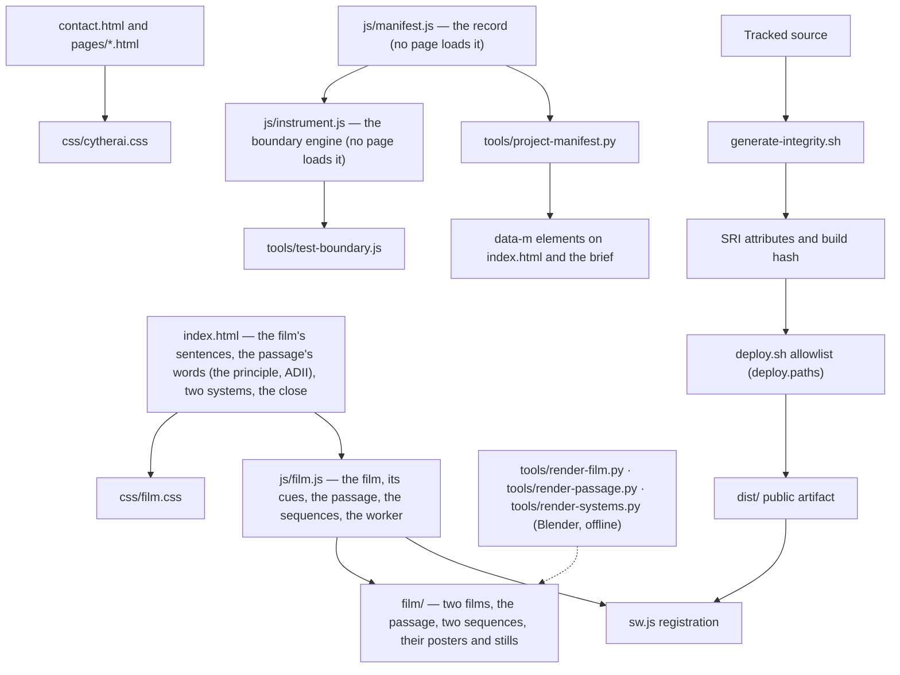

# Repository architecture

This guide describes the current tree, the runtime data flow, and the files that
must move together when the site changes. The repository is a zero-dependency
static site: source HTML, CSS, and JavaScript are served directly. There is no
framework, package graph, bundle, or server application.

The homepage is **the film** (since 2026-10-12): a twelve-second film, rendered offline and
silent, with its sentences as HTML over it; then **the passage** (since 2026-10-20), which the
scroll moves through: the film's final composition opens into ADII's scene, its words held at
its moments; then AWC-OS and CytherCAD, each a six-second sequence in the film's materials with
a headline, two sentences a shipped page states and one route into its evidence; then the
invitation. Its predecessors are retired
whole, each a verbatim snapshot with every verifier that established its laws and its own
`verify.sh`: **THE UNHAPPENED** to `backup/unhappened-v1/` (commit `011ffd0`; this guide as
it stood for it is `git show 011ffd0:docs/architecture.md`), **the drawing set** to
`backup/drawing-set-v1/` (commit `c921f00`) and **instrument-v1** to `backup/instrument-v1/`
(commit `9d6cbdb`). Each is superseded as presentation and preserved as historical record;
nothing of their design is carried into the front door.

## System map


```mermaid
flowchart TD
  I["index.html — the film's sentences, the passage's words (the principle, ADII), two systems, the close"] --> CSS2["css/film.css"]
  I --> F["js/film.js — the film, its cues, the passage, the sequences, the worker"]
  F --> MED["film/ — two films, the passage, two sequences, their posters and stills"]
  F --> SW["sw.js registration"]
  RF["tools/render-film.py · tools/render-passage.py · tools/render-systems.py (Blender, offline)"] -.-> MED

  P["contact.html and pages/*.html"] --> CSS["css/cytherai.css"]

  M["js/manifest.js — the record (no page loads it)"] --> B["js/instrument.js — the boundary engine (no page loads it)"]
  B --> TB["tools/test-boundary.js"]

  SRC["Tracked source"] --> SRI["generate-integrity.sh"]
  SRI --> ID["SRI attributes and build hash"]
  ID --> DEP["deploy.sh allowlist (deploy.paths)"]
  DEP --> DIST["dist/ public artifact"]
  DIST --> SW

  M --> PM["tools/project-manifest.py"] --> DM["data-m elements on index.html and the brief"]
```

The front door loads one stylesheet, `js/theme.js` in the head and one deferred script, all with SRI; `js/film.js`
reads no module and publishes nothing. No page loads the two record modules (THE EXCEPTION, the
last that did, retired on 2026-10-16 to `backup/exception-v1/`): the projector and the verifiers
run them under jsc, the manifest first. Their public surface is an inventory
(`tools/test-api.py`): every symbol is used by a tool, and a symbol with no caller fails.

| Module | Public API | Loaded by | Responsibility |
|---|---|---|---|
| `js/film.js` | — | `index.html`, `ar/index.html` | The film (source by orientation, cues, `still()`, `GUARD`), the passage (the scroll's moment through its stretches, seeks, its words' windows, the stills that stand in), the sequences' IntersectionObserver, `sw.js` registration and `take-over`; the films and the worker resolve against the site's root, so `ar/` shares them; DOM wiring behind `typeof document` |
| `js/theme.js` | — | `index.html`, `ar/index.html` (head, not deferred) | The theme: the remembered choice or the device's setting, as `data-theme`; the switch (`#theme`) |
| `js/manifest.js` | `CytherManifest` | no page (jsc) | The public manifest: `project` (the `data-m` facts, for the projector), `MANIFEST`, `VALIDATION`, `CANON`, `ADMISSION_NONCE`, `CHECKSUM` for the verifiers and the derived assets (`tools/canon.py`) |
| `js/instrument.js` | `CytherInstrument` | no page (jsc) | The boundary engine: `biEngine`, `audit` and `judge`, for the verifiers. Pure, DOM-free; `tools/test-boundary.js` pins the seed-02 stream |

## Directory and ownership map

| Path | Role | Public artifact? | Change rule |
|---|---|---|---|
| `index.html` | The film's sentences, the passage's stretches and words (the principle, ADII), the two other systems and the close | Yes | Every HTML byte moves the build identity: re-stamp after any edit; the invalid rate and its baseline are projector-owned (`data-m`) |
| `ar/index.html`, `ar/contact.html` | The front door and the contact page in Arabic | Yes | Every HTML byte moves the build identity; the Arabic front door keeps the English one's cues, sections, sequences and figures (`tools/test-site.py`) |
| `fonts/` | IBM Plex Sans Arabic 300 and 400, with its licence | Yes | Shipped unmodified (the licence reserves the name "Plex"); precached |
| `css/film.css`, `js/film.js`, `js/theme.js` | The front door's style and its scripts | Yes | Hashed (SRI); a change requires `./generate-integrity.sh` and re-stamping; reading ink over the film is a browser observation (CY-SEM-003) |
| `film/` | The two films with their final-frame posters, the passage in both orientations with its stills, two sequences with their posters | Yes | Rendered by `tools/render-film.py`, `tools/render-passage.py` (from the film's own scene) and `tools/render-systems.py`; every file the page names ships and every shipped file is named (`tools/test-site.py`) |
| `js/manifest.js`, `js/instrument.js` | The record and the boundary engine | No | Loaded by no page; the corpus binds their paths (`record_hash`, `kernel_hash`), so a change re-stamps |
| `css/cytherai.css` | Shared subpage style system | Yes | Hashed; its ink law is `tools/test-site.py` |
| `contact.html` | Contact surface with the repository's one inline form script | Yes | Preserve the explicit `mailto:`/no-backend semantics unless hosting changes |
| `pages/` | Brief and legal pages | Yes | Share navigation and CSS |
| `assets/` | Promoted deterministic images and icons | Selected files | Record provenance in `docs/asset-promotion-log.md`; add to `deploy.paths`; precache only if offline-critical |
| `tools/` | Generators, the film's Blender render scripts and zero-dependency test programs | No | Generators must reproduce committed bytes; tests must fail nonzero; a new harness file is added to `IDENTITY_COVERAGE` |
| `vaic/` | The VAIC-0 obligation corpus (`v3`, superseding `v2` and through it `v1` and `v0`, all kept as history), evaluator matrix, evidence ledger, release dispositions | No | Receipts append; admitted receipts are immutable across every lineage (`tools/test-vaic.py`) |
| `docs/` | Deployment contract and release record, asset provenance, architecture, the history rewrite | No | Evidence and operational instructions, never origin content |
| `backup/` | The record: the retired front doors whole with their verifiers, the design studies (`prototype/`, `newC3/`), the trajectory engine and its runner, the build plan of instrument-v1; indexed in `backup/README.md` | No | Historical record only; retire here, never delete, never deploy, never import from |
| `adii/` | ADII project page: the replay, its poster and fonts (shared with the homepage), the team's CVs | The reviewed set | Every URL its first publication served stays served; a new file ships only once named in `REVIEWED_PUBLICATION` (`tools/test-site.py`) |
| `awc-os/` | AWC-OS evaluation gateway (curated) and its films | The reviewed set | As `adii/`; `awc-os/live/` redirects to an ephemeral tunnel, is gitignored, and never ships; the gateway states no deployment claim the record does not support |
| `dist/` | Generated allowlisted release artifact | Generated | Rebuilt destructively by `deploy.sh`; never hand-edit |

## Homepage boot and steady state

`js/film.js` runs once the document is parsed.

1. It removes `no-js` (without the script, `.no-js` unveils the statement after 6 s, CSS). The
   statement is the `h1` and is exposed to assistive technology from the start, invisible but
   present; its links stay `visibility: hidden` until it appears. The film's text alternative is
   a `.sr` paragraph before it. The header's mark is the Cyther Seal, inline SVG, pixel-fitted at
   26 px (`tools/render-seal.py`); `tools/test-site.py` holds every inline seal to the computed one.
2. It picks the film and its poster by orientation (`film/film-landscape.mp4` or
   `film/film-portrait.mp4`) and plays it muted. Reduced motion skips straight to the still
   state with *Play the film* and downloads no film; a refused play, a media error, or no
   start within `GUARD` (6 s) does the same with *Replay*.
3. While the film plays, an 80 ms interval reads `currentTime` and shows each sentence in its
   window (`data-from`/`data-to`); the statement appears at 10.6 s. It also adds up how far
   the film has fallen behind real time since it started, while the page is visible (a hidden
   page's time does not count), so short pauses count together; past `STALL` (2 s) the film
   gives way to the still state at once: it drops its source, so the poster
   — its final frame — stands, and a late download cannot restart it; its caption leaves
   without a fade, so it never lies under the statement.
4. At the end (`ended`) `still()` stops the interval, holds the last frame, shows the whole
   statement and Replay. The film never restarts on its own.
5. Once the film is whole (or still), the passage downloads (asked to play and paused at once,
   so iOS fetches it) and is shown once whole and the film still, under the film's element: its
   first frame is the film's last. From then on the scroll names a moment, evenly (each stretch,
   `.passage`, is as tall as its seconds, `data-t`: 2 s a viewport, the stage's own pace), and the
   passage seeks to it, one seek at a time; each of its words (`.say`) fades in and out with the
   scroll in its window of those seconds. Until it is whole, under reduced motion or
   after a failed download, the film's element stands on the final frame, and past it on the
   still of ADII's moment (`film/passage-*.jpg`). Scrolling on past the film ends it; a page
   that opens past it (an anchor, a restored scroll) never plays it.
6. Once the passage is whole, the two sequences are warmed in turn: each is given its source,
   started muted off screen and paused as soon as it plays, so iOS Safari (which downloads a
   clip only when asked to play it, and buffers all of it first) has it ready. When half of a
   sequence is in view it plays once from its first frame and holds its last, which is also
   its poster; leaving view pauses it. One sequence downloads at a time (the slot; the film is
   outside it): a free slot goes to the first sequence in view still waiting for it, else to
   the next to warm; one arriving takes it from a clip warming off screen (which drops its
   download and goes back in the queue), never from another in view, which it waits behind.
   A slow start is never a failure. Refused, or stopped for
   `STALL` after it has moved while visible, it drops its source and rests on its poster, and
   tries again the next time it comes into view (a 250 ms watch runs only between a `playing`
   event and the next pause or end). An `AbortError` is not a failure. Reduced motion never
   plays them.
7. Once the film is still, the service worker registers from the root and is asked to take
   over; its cache name carries the build hash. Its install fetches the precache past the HTTP
   cache (0.7 MB), which on a first visit would take the link from the film as it starts.

At steady state nothing runs: no frame is requested (the page asks for one only while it
scrolls, to seek the passage), no media plays and no timer fires (CY-TEMP-001, `docs/deploy.md`
§5i). Replay, a scroll, a sequence scrolled back into view, or a turn of the device (the
sources follow the orientation while still) starts motion again.

## State and evidence boundaries

- Canonical facts come from `CytherManifest`: the two front-door figures and the brief's
  validation figures are projections, written into the pages by the projector.
- The film and the sequences are pre-rendered illustrations. The page says so under the
  film (*A conceptual visualization. It measures no product.*); no motion on the front door
  claims to correspond to a system event, and nothing on it is computed in the browser.
- Each system's sentences are ones its shipped page states, with its condition beside them
  and a route to the evidence; the film's sentences are positioning.
- The page discloses no obligation, receipt or verdict; the VAIC corpus under `vaic/` is the
  record, and a receipt for a build cannot be inside that build.

## Routes

| Route | Runtime |
|---|---|
| `/` or `/index.html` | The film: `css/film.css`, `js/theme.js` and `js/film.js`, all SRI'd; media from `film/` |
| `/ar/` | The film in Arabic: the same stylesheet, scripts and media |
| `/ar/contact.html` | The contact page in Arabic: shared CSS plus its inline validation/copy script, in Arabic |
| `/contact.html` | Shared CSS plus one inline validation/copy script |
| `/pages/brief.html` | Static capability brief and promoted exhibits |
| `/pages/privacy.html` | Static privacy record |
| `/pages/security.html` | Static disclosure policy |
| `/pages/terms.html` | Static terms |
| `/404.html` | Host-configured styled error body; the host must still return status 404 |

## Integrity, deployment, and offline behavior

The release flow is fail-closed:

1. Edit source. After a manifest edit run `python3 tools/project-manifest.py`.
2. For any change to a served file (anything in `deploy.paths`), run
   `./generate-integrity.sh` (SRI over the requested resources, each URL versioned by its bytes,
   `?v=` the first 12 hex of their SHA-256, in the pages and the worker's precache; the 16-hex build identity
   over every `deploy.paths` byte, stamped into every HTML file and the worker cache
   name), then `python3 tools/vaic_restamp.py` once per transaction.
3. Run `./verify.sh`.
4. `./deploy.sh` deletes and rebuilds `dist/` from `deploy.paths`; it rejects a precached
   asset missing from the artifact and rejects the historical directories.
5. Observe the build in a browser: `.venv/bin/python tools/probe-ink.py dist <dir>` (CY-SEM-003) and
   `.venv/bin/python tools/probe-settle.py dist <dir>` (CY-TEMP-001), and append their receipts.
6. `./publish.sh` pushes the contents of `dist/` as the single-commit `gh-pages` branch
   GitHub Pages serves at `cytherai.com` (`CNAME`, `.nojekyll` are in the artifact), keeping the
   artifact it replaces as the local branch `rollback/<its build>`. It refuses any uncommitted
   change, a HEAD not on `master`, and a failing `./verify.sh`. Then `python3 tools/probe-origin.py
   dist <out.json>` observes the live origin (CY-ORIGIN-001). The origin contract and Pages'
   recorded limits are `docs/deploy.md` §1–§4, §7.

The service worker precaches the pages, the front door's script and stylesheet, the two
final-frame posters it stands on when the film cannot play (offline included), and the three
`adii/fonts/` files it draws its type with; films go to the network, never the cache. It
installs one build or
nothing (every fetch past the HTTP cache, the build stamp checked before commit), maps a
navigation to a directory it precached (`/`, `/ar/`) to its cached `index.html`, leaves every
page it did not precache (`adii/`, `awc-os/`) to the network, caches what else it fetches
past the HTTP cache too, and removes older caches on activate.
A new build's worker waits: it never takes over a page that may still be loading. Safari
checks for the update at the navigation itself, so a worker that skipped waiting answered a
returning reader's previous-build page, mid-load, with this build's modules, and the page
died of its own SRI check; Safari's script requests carry no integrity a worker could read,
and the page is not reliably among the worker's clients when it activates, so no rule inside
the worker can tell such a page apart. Instead the page decides: once its own script has
run and its film is still, `js/film.js` sends `take-over` to a waiting worker, and the next load is the
new build. A page from before this rule never asks; its tab moves to the new build once no
page of the old build is open. Reproduced, and the fix verified with a negative control, in
the iOS 26.5 simulator (`docs/deploy.md` §5g).

## Verification map

```sh
./verify.sh
```

Module parsing, the public API inventory, the boundary stream, the projection laws,
page/resource integration (everything a page or stylesheet fetches is a shipped file of this
origin, every link that stays on the site lands on one, every film the front door names ships,
and back), each page's least-privilege CSP, the retired register kept out of served files, the
privacy policy naming exactly what the site stores, SRI/build/cache identity, deployment
closure, the subpage ink law, the derived-asset receipts (the film's included), and the VAIC-0
corpus (structure, retired-evidence resolution, every lineage, frozen obligation definitions,
fail-closed controls, a regression recordable as a FAIL). The retired front doors: `backup/unhappened-v1/verify.sh`,
`backup/drawing-set-v1/verify.sh`, `backup/instrument-v1/verify.sh`.

Browser-only validation remains required for: the film as rendered at desktop and phone
widths, each sentence in its window and the still state; reading ink over the film and its
local darkening at glyph support (CY-SEM-003; seeking a film needs a server that answers byte
ranges); the settled state (no frame, media or timer once settled); reduced motion and a
refused play; zero external requests; service-worker install/update/offline; Safari/WebKit
muted inline autoplay and VoiceOver.

## Change-impact recipes

- Add or remove a front-door script or stylesheet: `index.html`, `generate-integrity.sh`
  (RESOURCES), `deploy.paths`, `sw.js`, `tools/test-site.py` (the script list), `IDENTITY_COVERAGE`
  (`grammar_hash`), and this guide. Each page's `script-src` is exactly what it runs: `'self'` for its own
  scripts, a `sha256-` source per inline script (the contact pages' form script: edit it, and the hash
  `tools/test-site.py` computes must be the one in the page's CSP), `'none'` for none.
- Change the front door's words: change `index.html` and `ar/index.html` together. A cue, a section, a sequence or a
  figure in one and not the other fails `tools/test-site.py`; a figure is the projector's (`data-m`) on both. Re-render
  both cards (`python3 tools/render-og-film.py`, `… ar`) if the statement moves, and record both digests.
- Add a theme token: give it a value in `:root` and in the light block of `css/film.css`; the ink law reads both.
- Re-render a film or a sequence: `blender -b --factory-startup --python-exit-code 1 -P tools/render-film.py -- <l|p> anim <dir> …`
  or `tools/render-systems.py` (usage in each script's header; the published films used 64
  samples with `TL=24`/`TL=14` landscape/portrait, the sequences 48 with `TL=10`), encode with
  `ffmpeg -framerate 24 -i <dir>/f%04d.png -c:v libx264 -preset slow -crf 23 -pix_fmt yuv420p
  -movflags +faststart <out>.mp4` (the master) and the last frame as its poster. The films are
  delivered lighter than their masters, because Safari starts a film only once it expects to play
  through: `ffmpeg -i <master> [-vf scale=1440:810:flags=lanczos] -c:v libx264 -preset veryslow
  -tune film -crf 29 -pix_fmt yuv420p -movflags +faststart -an film/film-<orientation>.mp4`
  (landscape scaled to 1440×810, about 2.7 Mbit/s; portrait at 810×1440, about 2.3 Mbit/s). The
  render frames of the published films were not kept; their CRF 23 masters are
  `git show e40fa72:film/film-<orientation>.mp4`. Replace the files under
  `film/`, regenerate integrity, and observe reading ink again: the ground under every caption
  has changed.
- Re-render the passage: it is rendered from the film's own scene, so its first frame stays the film's last. Build the
  scene, `blender -b --factory-startup --python-exit-code 1 -P tools/render-film.py -- <l|p> blend <dir> 1920x1080`
  (`1080x1920` portrait) `64`, then `TL=24` (`TL=14` portrait) `blender -b --factory-startup <dir>/film-<l|p>.blend
  --python-exit-code 1 -P tools/render-passage.py -- <l|p> anim <dir> 1920x1080 64`, and encode its frames (f0288 on)
  with a keyframe every six (a scrubbed video seeks; each seek decodes from the keyframe before it):
  `ffmpeg -framerate 24 -start_number 288 -i <dir>/f%04d.png -vf scale=1440:810:flags=lanczos` (`810:1440`)
  `-c:v libx264 -preset veryslow -tune film -crf 29 -g 6 -keyint_min 6 -sc_threshold 0 -pix_fmt yuv420p -movflags
  +faststart -an film/passage-<orientation>.mp4`; its still is the frame at 8.0 s (f0480), `film/passage-<orientation>.jpg`.
  The pages' `data-t` name the passage's seconds (a stretch's first and last, a caption's window): move a moment in the
  script and move them with it, on both pages, keeping each stretch as tall as its seconds (50svh a second).
- Change the mark: never by hand. `python3 tools/render-seal.py` writes the icons;
  `python3 tools/render-seal.py svg SIZE INK GROUND` prints the inline seal for a page; record
  the digests in `docs/asset-promotion-log.md` (IMG-009) and re-render the social card.
- Add a public page: navigation links/current-page state, build-hash meta, CSP, local
  icon/manifest references, `deploy.paths` (which is also the list `generate-integrity.sh` stamps and
  every per-page law in `tools/test-site.py` reads), and decide whether it belongs in `sw.js`.
- Add a claim to the front door: only as a shipped source states it, with its condition
  beside it and a link to the source; a figure is a `data-m` projection (add it to
  `HEADLINE` in `tools/test-projection.py`). An unsupported claim is dropped.
- Change manifest facts: review every `PROVISIONAL` marker, run the projector, regenerate
  integrity, and treat a genuine commitment as an owner-custody decision.
- Change an obligation: a new corpus version that supersedes the live one and carries every
  receipt verbatim (CARRIED_FORWARD or SUPERSEDED per row); re-stamp; never edit an
  admitted receipt.
- Retire a served file: move it whole into the declared snapshot, add it to `RETIRED`,
  remove it from `deploy.paths`; the receipts that cite it keep resolving.
